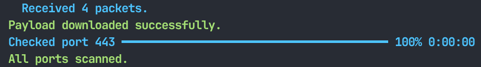

# PwnLogger

<div align="center">

[](https://github.com/Eudaeon/pwnlogger/stargazers)
[](https://github.com/Eudaeon/pwnlogger/network)
[](https://github.com/Eudaeon/pwnlogger/issues)
[](LICENSE)

**A lightweight logging utility built on `rich`.**

</div>

## 📖 Overview

This library is designed to provide simple, structured feedback during the execution of scripts. It abstracts complex `rich` components into a simple API for common logging tasks, including spinners and persistent progress bars that support nested log lines.

## 📦 Setup

### Installation

```bash
pip install git+https://github.com/Eudaeon/pwnlogger.git
```

## 🔧 Usage

### Basic Logging

Import `logger` and `LogLevel` to set verbosity and output styled messages.

```python
from pwnlogger import logger, LogLevel

# Set the minimum threshold (default is DEBUG)
logger.set_level(LogLevel.INFO)

logger.info("Initializing exploit chain...")
logger.success("Target unreachable, switching to backup gateway.")
logger.warn("Certificate validation disabled (unsound configuration).")
logger.error("Connection reset by peer.")

# This will be hidden because the level is set to INFO
logger.debug("Payload size: 4096 bytes")
```

<div align="center">


</div>

### Status Spinner

Use the `status` manager for long-running tasks where the duration is unknown.

```python
import time
from pwnlogger import logger, LogLevel

# Start a spinner (default log level is INFO)
with logger.status("Establishing secure tunnel...", level=LogLevel.INFO) as s:
    time.sleep(1)
    # Log sub-steps without breaking the spinner animation
    s.info("Handshake complete. Negotiating cipher...")
        
    time.sleep(1)
    # Update the spinner message
    s.update("Verifying session keys...")

    # Log success messages inside the status context
    s.success("Session keys confirmed.")
        
    time.sleep(1)

    # Finalize the status with a custom message and level SUCCESS
    s.finish("Tunnel established successfully.", level=LogLevel.SUCCESS)
```

<div align="center">


</div>

### Progress Bar

Use `progress` for iterative tasks. These bars persist in the console and support nested logging.

```python
import time
from pwnlogger import logger, LogLevel

targets = ["192.168.1.10", "192.168.1.15", "192.168.1.22", "192.168.1.30"]

# Start a progress bar (default log level is INFO)
with logger.progress("Scanning targets...", total=len(targets)) as p:
    for i, target in enumerate(targets):
        # Update progress description and advance count
        p.update(advance=1, description=f"Scanning {target}")
        
        if target == "192.168.1.22":
            # Log sub-steps without breaking the progress animation
            p.warn(f"High latency detected on {target}")

            time.sleep(0.5)

            # Log info messages
            p.info(f"Port 8080 open on {target}")
        
        time.sleep(0.3)
    
    # Finalize the progress
    p.finish("Scan complete. 4 targets analyzed.", level=LogLevel.SUCCESS)
```

<div align="center">


</div>

### Async Support

`pwnlogger` supports `async with` for both the status spinner and progress bar, allowing you to run animations during asynchronous operations without blocking the event loop.

```python
import asyncio
from pwnlogger import logger, LogLevel

async def fetch_data():
    # The spinner will animate while `await` pauses execution
    async with logger.status("Fetching payload from C2 server...") as s:
        # Simulate network latency
        await asyncio.sleep(1.5)
        
        s.info("Received 4 packets.")
        await asyncio.sleep(0.5)
        
        s.finish("Payload downloaded successfully.", level=LogLevel.SUCCESS)

async def scan_ports():
    ports = [21, 22, 80, 443]
    async with logger.progress("Scanning ports...", total=len(ports)) as p:
        for port in ports:
            await asyncio.sleep(0.3)
            p.update(advance=1, description=f"Checked port {port}")
        
        p.finish("All ports scanned.", level=LogLevel.SUCCESS)

async def main():
    await fetch_data()
    await scan_ports()

asyncio.run(main())
```

<div align="center">



</div>

## ⚙️ Configuration

### Log Levels

PwnLogger uses the `LogLevel` enum to control output.

<div align="center">

|   Level   | Value |    Style    |
|:---------:|:-----:|:-----------:|
|  `DEBUG`  |   10  |     Dim     |
|  `INFO`  |   20  |  Bold Blue  |
|  `WARN`  |   30  | Bold Yellow |
| `SUCCESS` |   40  |  Bold Green |
|  `ERROR`  |   50  |   Bold Red  |

</div>

---

<div align="center">

**⭐ Star this repo if you find it helpful!**

Made with ❤️ by [Eudaeon](https://github.com/Eudaeon)

</div>
