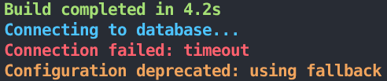
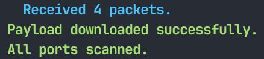
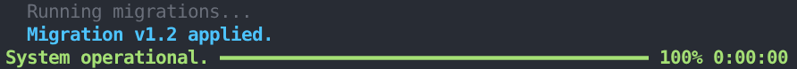

# PwnLogger

<div align="center">

[](https://github.com/Eudaeon/connection-mapper/stargazers)
[](https://github.com/Eudaeon/connection-mapper/network)
[](https://github.com/Eudaeon/connection-mapper/issues)
[](LICENSE)

**A lightweight logging utility built on `rich`.**

</div>

## 📖 Overview

This library is designed to provide simple, structured feedback during the execution of scripts. It abstracts complex `rich` components into a simple API for common logging tasks, including spinners and persistent progress bars that support nested log lines.

## 📦 Setup

### Installation

```bash
pip install git+https://github.com/Eudaeon/pwnlogger.git
```

## 🔧 Usage

### Basic Logging

Import `logger` and `LogLevel` to set verbosity and output styled messages.

```python
from pwnlogger import logger, LogLevel

# Set the minimum threshold (default is DEBUG)
logger.set_level(LogLevel.INFO)

logger.success("Build completed in 4.2s")
logger.info("Connecting to database...")
logger.error("Connection failed: timeout")
logger.warn("Configuration deprecated: using fallback")

# This will be hidden because the level is set to INFO
logger.debug("Stack trace: 0xDEADBEEF")
```

<div align="center">



</div>

### Status Spinner

Use the `status` manager for asynchronous or long-running tasks where the duration is unknown.

```python
import time
from pwnlogger import logger, LogLevel

# Start a spinner with a specific log level (default is INFO)
with logger.status("Provisioning resources...", level=LogLevel.INFO) as s:
    time.sleep(1)
    # Log sub-steps without breaking the spinner animation
    s.info("Instance 'web-node-01' initialized.")
        
    time.sleep(1)
    # Update the spinner message
    s.update("Configuring networking...")

    # Log sub-steps without breaking the spinner animation
    s.success("Load balancer attached.")
        
    time.sleep(1)

    # Finalize the status with a custom message and level SUCCESS
    s.finish("Service deployed successfully", level=LogLevel.SUCCESS)
```

<div align="center">



</div>

### Progress Bar

Use `progress` for iterative tasks. These bars persist in the console after completion and support nested logging.

```python
import time
from pwnlogger import logger, LogLevel

tasks = ["Auth", "Database", "Cache", "Frontend"]

# Start a progress (default log level is INFO)
with logger.progress("Initializing system...", total=len(tasks)) as p:
    for i, task in enumerate(tasks):
        # Update the progress message and completion
        p.update(advance=1, description=f"Setting up {task}")
        
        if task == "Database":
            # Log sub-steps without breaking the progress animation
            p.debug("Running migrations...")

            time.sleep(0.8)

            # Log sub-steps without breaking the progress animation
            p.info("Migration v1.2 applied.")
        
        time.sleep(0.4)
    
    # Finalize the progress with a custom message and level SUCCESS
    p.finish("System operational.", level=LogLevel.SUCCESS)
```

<div align="center">



</div>

## ⚙️ Configuration

### Log Levels

PwnLogger uses the `LogLevel` enum to control output.

<div align="center">

|   Level   | Value |    Style    |
|:---------:|:-----:|:-----------:|
|  `DEBUG`  |   10  |     Dim     |
|   `INFO`  |   20  |  Bold Blue  |
|   `WARN`  |   30  | Bold Yellow |
|  `ERROR`  |   40  |   Bold Red  |
| `SUCCESS` |   50  |  Bold Green |

</div>

---

<div align="center">

**⭐ Star this repo if you find it helpful!**

Made with ❤️ by [Eudaeon](https://github.com/Eudaeon)

</div>
